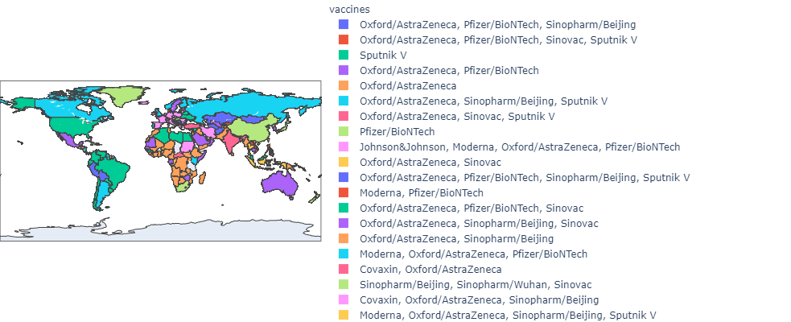

<h3> In this project, I have tried to demonstrate the different types of vaccines used by different countries.</h3>  
1. The dataset is downloaded from kaggle and it is regularly being updated. 
2. Dataset Link: https://www.kaggle.com/gpreda/covid-world-vaccination-progress 
3. The visualization is done with the help of "Plotly" library in.    

